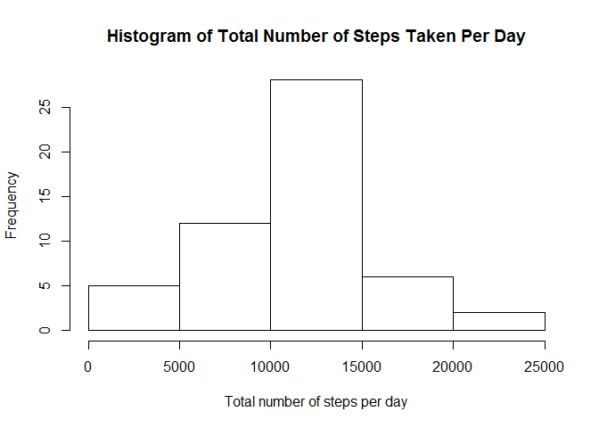
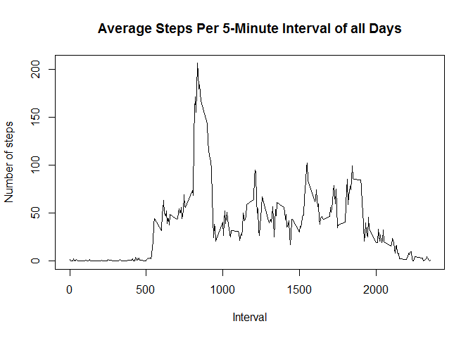
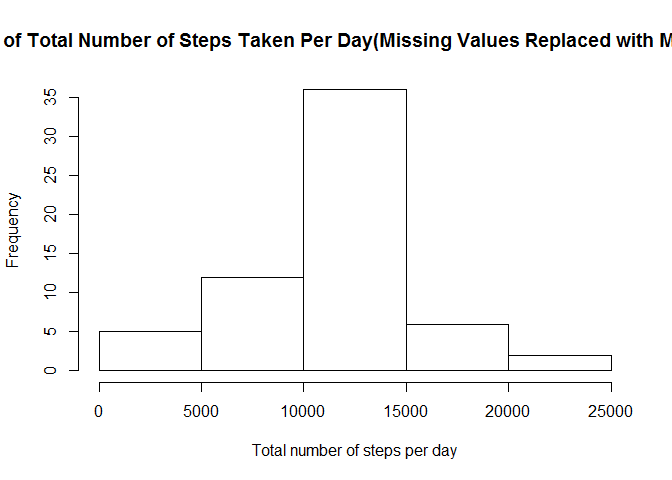
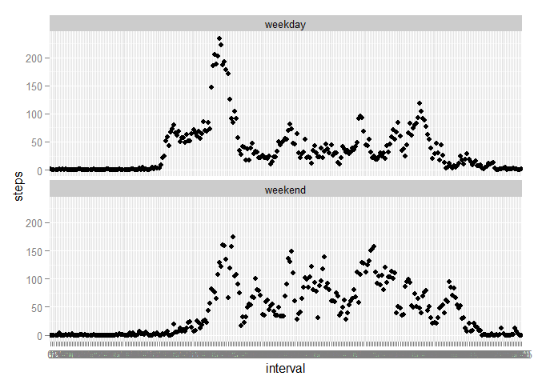

# RepData_PeerAssessment1

##Loading and preprocessing the data


```r
##1.Show any code that is needed to load the data.
library(knitr)
url <- "https://d396qusza40orc.cloudfront.net/repdata%2Fdata%2Factivity.zip"
if (!file.exists("activity.csv")) {
        download.file(url, destfile = "activity.zip", method="curl")
        unzip("activity.zip")
}
data=read.csv("activity.csv")

##2.Process/transform the data (if necessary) into a format suitable for your analysis.
str(data)
```

```
## 'data.frame':	17568 obs. of  3 variables:
##  $ steps   : int  NA NA NA NA NA NA NA NA NA NA ...
##  $ date    : Factor w/ 61 levels "2012-10-01","2012-10-02",..: 1 1 1 1 1 1 1 1 1 1 ...
##  $ interval: int  0 5 10 15 20 25 30 35 40 45 ...
```

```r
head(data)
```

```
##   steps       date interval
## 1    NA 2012-10-01        0
## 2    NA 2012-10-01        5
## 3    NA 2012-10-01       10
## 4    NA 2012-10-01       15
## 5    NA 2012-10-01       20
## 6    NA 2012-10-01       25
```

##What is mean total number of steps taken per day?

For this part of the assignment, you can ignore the missing values in the dataset.


```r
##1.Make a histogram of the total number of steps taken each day.
data1<-na.omit(data)
TotlSteps <- aggregate(data1[1],by=data1[2],FUN=sum)
hist(TotlSteps$steps,
     main = "Histogram of Total Number of Steps Taken Per Day",
     xlab = "Total number of steps per day")
```

 

```r
##2.Calculate and report the mean and median total number of steps taken per day.
mean(TotlSteps$steps)
```

```
## [1] 10766.19
```

```r
median(TotlSteps$steps)
```

```
## [1] 10765
```

**Therefore, the mean and median total number of steps per day are 10766 and 10765 steps respectively.**

##What is the average daily activity pattern?


```r
##Make a time series plot (i.e. type = "l") of the 5-minute interval (x-axis) and the average number of steps taken, averaged across all days (y-axis)
StepsInterval=aggregate(data1[1],by=data1[3],FUN=mean)
plot(StepsInterval$interval, StepsInterval$steps, type='l', 
     main="Average Steps Per 5-Minute Interval of all Days", xlab="Interval", 
     ylab="Number of steps")
```

 

```r
##Which 5-minute interval, on average across all the days in the dataset, contains the maximum number of steps?
StepsInterval$interval[which.max(StepsInterval$steps)]
```

```
## [1] 835
```

**Therefore, interval 835 has the maximum average number of 206.2 steps.**

##Imputing missing values

Note that there are a number of days/intervals where there are missing values (coded as NA). The presence of missing days may introduce bias into some calculations or summaries of the data.


```r
##1.Calculate and report the total number of missing values in the dataset (i.e. the total number of rows with NA's)
sum(is.na(data$steps))
```

```
## [1] 2304
```

**So the total number of rows with NA's is 2304.**


```r
##2.Devise a strategy for filling in all of the missing values in the dataset. The strategy does not need to be sophisticated. 

##I choose to use the meanthe mean for that 5-minute interval.

##3.Create a new dataset that is equal to the original dataset but with the missing data filled in.
data2 <- data
for (i in 1:nrow(data2)) {
  if (is.na(data2$steps[i])) {
    data2_interval <- data2$interval[i]
    data2_steps <- StepsInterval[StepsInterval$interval == data2_interval,]
    data2$steps[i] <- data2_steps$steps
  }
}

TotlSteps2 <- aggregate(data2[1],by=data2[2],FUN=sum)

## calculate mean and median of imputed total number of steps per day
mean(TotlSteps2$steps)
```

```
## [1] 10766.19
```

```r
median(TotlSteps2$steps)
```

```
## [1] 10766.19
```

```r
##Make a histogram of the total number of steps taken each day and Calculate and report the mean and median total number of steps taken per day. Do these values differ from the estimates from the first part of the assignment? What is the impact of imputing missing data on the estimates of the total daily number of steps?
hist(TotlSteps2$steps,
     main = "Histogram of Total Number of Steps Taken Per Day(Missing Values Replaced with Mean of Interval",
     xlab = "Total number of steps per day")
```

 

**Mean values do not differ from the precious result, but the meadian value increased a bit and now equals to the mean.**

##Are there differences in activity patterns between weekdays and weekends?

For this part the weekdays() function may be of some help here. Use the dataset with the filled-in missing values for this part.


```r
##Create a new factor variable in the dataset with two levels -- "weekday" and "weekend" indicating whether a given date is a weekday or weekend day.

data1$date <- as.Date(data1$date, "%Y-%m-%d")
data1$day <- weekdays(data1$date)
data1$day_type<- "weekday"
data1$day_type[data1$day %in% c("Saturday","Sunday")] <- "weekend"

##Make a panel plot containing a time series plot (i.e. type = "l") of the 5-minute interval (x-axis) and the average number of steps taken, averaged across all weekday days or weekend days (y-axis).
data1$interval<-as.factor(data1$interval)
data1$day_type<-as.factor(data1$day_type)
TotSteps3 <- aggregate(data1[1],by=data1[c(3,5)],FUN=mean)
library(ggplot2)
data1$interval<-as.factor(data1$interval)
data1$day_type<-as.factor(data1$day_type)
TotSteps3 <- aggregate(data1[1],by=data1[c(3,5)],FUN=mean)
qplot(interval,steps,data=TotSteps3)+geom_line()+facet_wrap(~day_type,nrow=2)
```

 
